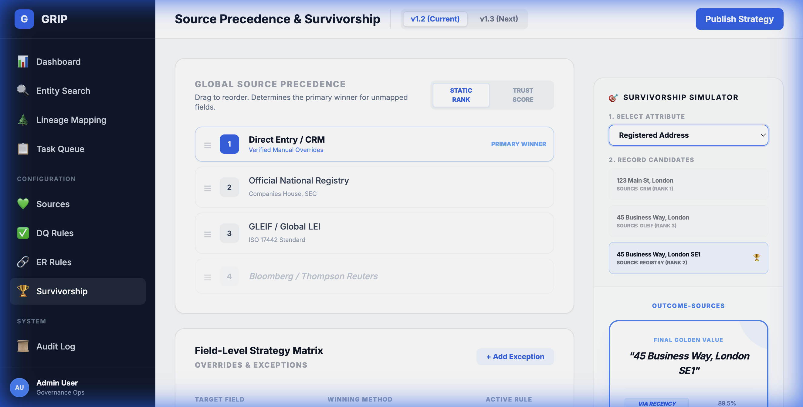

# Walkthrough - Navigation & Interactivity Finalization

I have completed the final phase of navigation and interactivity improvements for the GRIP application mockups. This work ensures that the prototype is logically connected, consistent in design, and fully functional for demonstration purposes.

## Key Improvements

### 1. Interactivity & Functionality
- **Manage Task (`manage-task.html`)**:
    - Implemented a fully functional `toggleView()` script to switch between **Conflict Comparison** and **Golden Record View**.
    - Added a **Cancel** button in the header for better UX.
    - Linked the **Approve & Publish** button to the `task-queue.html`.
    
- **Edit Entity (`edit-entity.html`)**:
    - Fixed a broken **Publish Changes** button (restored missing HTML tags and added link).
    - Added a **Cancel** button that returns the user to `entity-detail.html`.

### 2. Navigation Consistency
- **Standardized Sidebars**:
    - Verified the presence of the standardized sidebar across all pages.
    - Specifically fixed `view-lineage.html` which was missing the `#sidebar` ID required for the dynamic active state logic.
- **Dynamic Active States**:
    - Confirmed that the JavaScript snippet correctly highlights the current page in the sidebar based on the URL on all pages.

### 3. Ruleset Versioning & Preview
- **Versioning Logic**: Implemented version toggles in `dq-rules.html`, `er-rules.html`, `survivorship-rules.html`, and `mapping-studio.html`.
- **Status Banners**: Added interactive warning banners for unreleased versions (e.g., v1.3).
- **Live Transformation Preview**: Added a modal in `mapping-studio.html` showing **Raw Source Data** vs. **Mapped CDM Output**.
    

### 4. Entity Resolution UI
- **Enhanced Labels**: Added **"PARTY"** and **"REGISTRY RECORD"** labels for clear data provenance.
- **Candidate Browsing**: Visualized multiple match candidates with "Candidate 1 of 3" navigation and **Match Score** badges.
    

### 5. Rule Management (DQ/ER)
- **Centralized Editor**: Created `manage-rule.html`, a unified, form-based logic builder.
- **Dry-Run Simulation**: Integrated a LIVE test section to run rules against sample data before saving.
    

### 6. User Management
- **Invite User**: Added a premium modal with backdrop blur for inviting new teammates.
- **Edit Permissions**: Created a dedicated toggle-based screen for granular access control.
    

### 7. Survivorship & Golden Record Refinement
- **Streamlined Simulator**: Simplified multi-step animations into a direct **Attribute & Record Selection** flow.
- **Outcome-Sources**: Immediately presents the final **Golden Result** alongside a verified **Lineage Trace**.
    

### 8. Unified Entity Resolution Experience
- **Vertical Stacked Table Layout**: The **Resolution** section in both `edit-entity.html` and `entity-establish.html` has been redesigned from a side-by-side grid to a vertically stacked arrangement of full-width cards.
    - **Active Target Card**: The entity context is now presented in a prominent header card.
    - **Internal Matches (Goldens)**: Potential duplicates are displayed in a full-width table with integrated **ER Rule Warnings**.
    - **External Matches (Registry)**: Search results are presented in a matching table format for consistency.
- **Harmonized 3-Step Workflow**: Both workflows now follow a standardized 3-step progression: **Resolution** → **Manual Edits** → **Final Review**.
    - **Refined Final Review**: Step 3 now includes a comprehensive summary with a **Manual Attribute Overrides** table (showing field-level diffs) and a **Source Maintenance & Linkage** table (showing active vs. unlinked source records).
    - **Expandable Preview**: Added a toggleable **"Full Preview"** card that exposes the complete entity state (Identity, Fund Info, Identifiers) to verify all information before publishing.
    - **Updated Actions**: "Discard Session" and "Commit & Sync" have been streamlined to **Discard** and **Publish**.

````carousel

<!-- slide -->

<!-- slide -->

<!-- slide -->

````

### 9. Task Management Refinement
- **Same Entity Verification**:
    - **Simplified Comparison**: Renamed "Compare Side-by-Side" to **Compare** for a cleaner list view.
    - **Filtered Context**: Removed direct "Merge" buttons from the initial list, ensuring users review differences first.
    - **Expandable Comparison**: Field-level comparisons highlight matching (green), conflicting (red), and mismatched (amber) data.
    - **In-Context Merge**: Added specific **Merge Current to Match** and **Merge Match to Current** buttons inside the expanded comparison view.
- **Refined Field-Level Conflict Resolution**:
    - **Purpose 1: Manual Edit Verification**: Dedicated view for re-confirming manual overrides that now mismatch fresh source data.
    - **Purpose 2: Risky Cross-Source Matching**: Explicit warnings for significant data drift across sources, requiring user confirmation.
    - **Evidence Links**: Added functional links to manual overrides (e.g., [📄 View Evidence Doc]) to support verification against source documents.
- **Source Linkage Management**:
    - **Registry Records Table**: Centralized view of all linked registry records with their sync status.
    - **Simplified Actions**: Streamlined the interface with a single **Unlink** action for active records.

````carousel

<!-- slide -->

<!-- slide -->

````

### 10. Audit Log Refinement
- **Dynamic Search**: High-performance "Real-time" search that filters by target or changes.
- **Granular Filters**: Native filtering across Action Types (Ingestion, Override, etc.).
- **Polished States**: Added a premium-styled empty state for filtered results.


### 11. Entity Resolution Rule Examples
- **Expanded Auto-Merge Rules**: Added four new high-confidence matching scenarios to `er-rules.html`.
- **Diverse Identifiers**: Rules now cover cross-matching on multiple IDs (LEI, VAT, BIC), parent entity relationships, and domain/email verification.
- **Visual Consistency**: New rules use the established "Auto-Merge" badging and clean label styling for clarity.


### 12. Data Quality Rule Population
- **Expanded Rule Suite**: Added checks for Incorporation Date validity, Jurisdiction (ISO codes), Active Status alignment, and Tax ID formatting.
- **Severity Badging**: Consistent use of Critical, High, Medium, and Low severity indicators across the list.


### 13. Rule Creation Template Gallery
- **Guided Onboarding**: New "Add New Rule" workflow begins with a template gallery to simplify configuration.
- **Categorized Templates**: Rules are grouped by Field Validation, Entity Resolution, and Reference Data patterns.
- **Dynamic Routing**: The gallery automatically routes users to the appropriate specialized manager (`manage-dq-rule.html` or `manage-er-rule.html`) based on the selected template.


### 14. Specialized Rule Managers
- **DQ Manager**: A streamlined editor for field-level validation and reference data checks.
- **ER Manager**: A specialized interface for matching logic (deterministic/probabilistic) featuring high-confidence auto-merge actions.

### 15. Refined ER Match Simulator
- **Incoming Feed View**: The simulator now features a scrollable "Incoming Feed" with multiple pending records, reflecting a realistic batch processing queue.
- **Record Selection**: Users can click individual records in the feed to load them into the simulator for testing.
- **Visual Record Cards**: High-level details (Legal Name, LEI, Reg ID) are displayed for the active record in a clean, card-based layout.
- **Side-by-Side Comparison**: Detailed field-level breakdown shows the Incoming Record vs. the Golden Candidate, including fuzzy similarity scores.


## Final State Assessment

The mockup suite is now fully navigable and provides a cohesive user experience. You can browse the entire collection starting from the landing page.

### Entity Resolution & Establishment
A unified, multi-step wizard for both establishing new entities and resolving conflicts in existing ones.

#### [NEW] Entity Establishment: Search & Discovery
The first step allows users to proactively identify registry records before resolution.


#### [NEW] Document-Centric Manual Edits
The "Manual Edits" step has been completely refined to integrate documentary evidence directly into the editing flow.
- **Full Attribute Sidebar**: Includes Identity, Identifiers, Industry Classifications, and Investment Fund details.
- **Document Grounding**: Attributes are linked to specific document extracts with "Verify" highlights.
- **Discovery & Inventory**: Search live registries and manage linked documents (Articles of Association, Registry Extracts).
- **Interactive PDF Preview**: A full-featured viewer shell for cross-referencing values against scanned certificates.


#### Entity Resolution Parity
Both establishment and edit flows now share the same rich comparison and resolution logic.
- **Consistent Resolution Logic**: The "Establish New Entity" and "Edit Entity Metadata" flows now use the exact same rich comparison and verification cards as the Task Management system.
- **Embedded Comparative UI**: Users can now perform side-by-side comparison of draft data against existing Golden Records directly within the establishment and edit wizards.
- **Field-Level Detail**: Includes the toggleable "Proposed Golden Record" view and detailed field-level mismatch highlighting.


[Open Landing Page](mockups/index.html)
