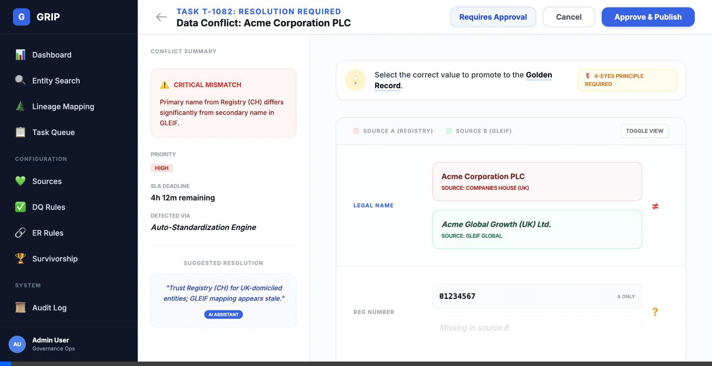
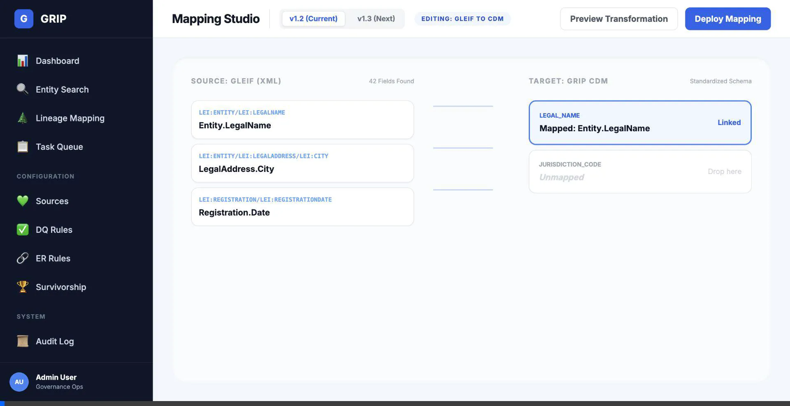
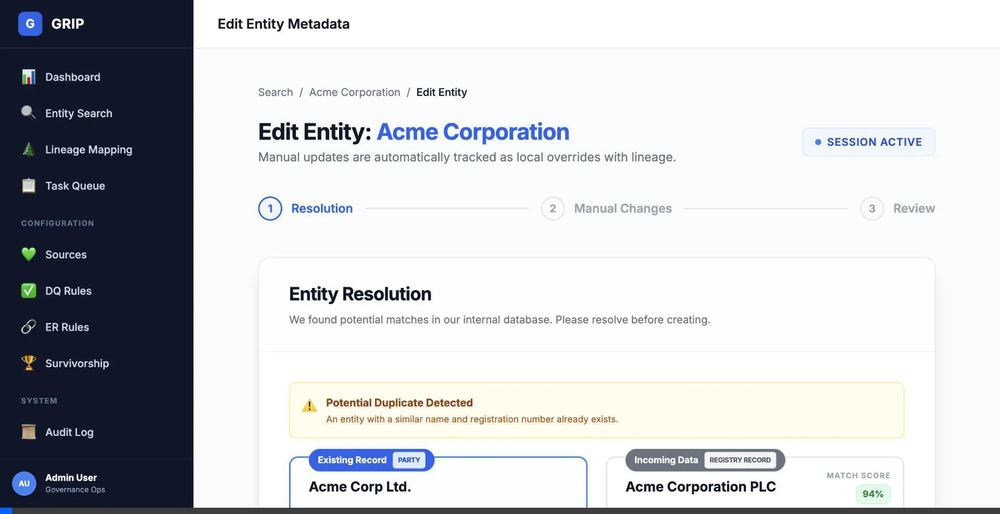
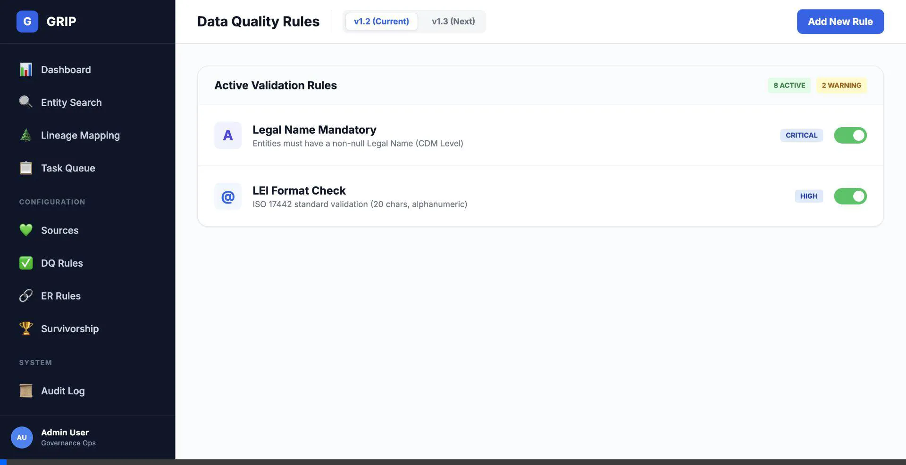
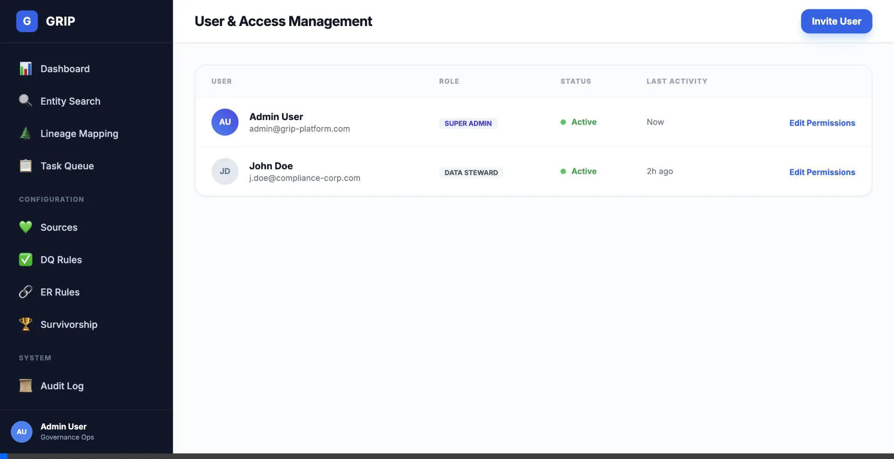
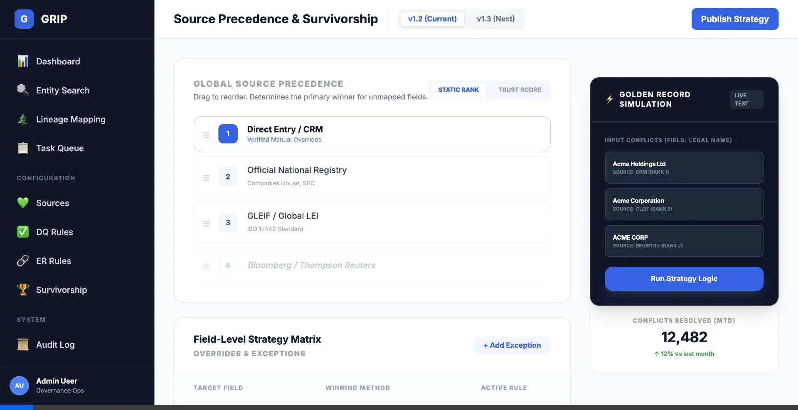

# Walkthrough - Navigation & Interactivity Finalization

I have completed the final phase of navigation and interactivity improvements for the GRIP application mockups. This work ensures that the prototype is logically connected, consistent in design, and fully functional for demonstration purposes.

## Key Improvements

### 1. Interactivity & Functionality
- **Manage Task (`manage-task.html`)**:
    - Implemented a fully functional `toggleView()` script to switch between **Conflict Comparison** and **Golden Record View**.
    - Added a **Cancel** button in the header for better UX.
    - Linked the **Approve & Publish** button to the `task-queue.html`.
    
- **Edit Entity (`edit-entity.html`)**:
    - Fixed a broken **Publish Changes** button (restored missing HTML tags and added link).
    - [x] Add a **Cancel** button that returns the user to `entity-detail.html`.
    - [x] Add modal structure and overlay to `user-management.html`
    - [x] Add JavaScript to handle modal open/close
- [x] Implement Advanced Strategy UI
    - [x] Add Strategy Matrix for field-level rules
    - [x] Update Global Precedence list with more sources
- [x] Build Golden Record Simulation
    - [x] Create conflict simulation panel
    - [x] Implement "Solve Conflict" animation logic
- [x] Final Verification
    - [x] Verify walkthrough simulation
    - [x] Verify versioning persistence
- **Entity Detail (`entity-detail.html`)**:
    - Verified and ensured the **Discover & Link** button correctly routes to `entity-evidence.html`.

### 2. Navigation Consistency
- **Standardized Sidebars**:
    - Verified the presence of the standardized sidebar across all pages.
    - Specifically fixed `view-lineage.html` which was missing the `#sidebar` ID required for the dynamic active state logic.
- **Dynamic Active States**:
    - Confirmed that the JavaScript snippet correctly highlights the current page in the sidebar based on the URL on all pages.
- **Breadcrumbs & Headers**:
    - Audited headers and breadcrumbs for structural consistency. Detail pages now consistently feature back buttons or breadcrumb paths in their titles.

### 3. Link Routing Audit
Verified the following critical routes:
- `login.html`: **Sign In** → `dashboard.html`
- `entity-search.html`: **Export Results** → `snapshot-export.html`
- `entity-search.html`: **Table Rows** → `entity-detail.html`
- `source-detail.html`: **Table Rows** → `source-profile.html`
- `source-profile.html`: **Header Back Button** → `source-detail.html`
- `mapping-studio.html`: **Deploy/Preview Buttons** → `lineage-overview.html`

### 3. Ruleset Versioning
- **Versioning Logic**: Implemented version toggles in `dq-rules.html`, `er-rules.html`, `survivorship-rules.html`, and `mapping-studio.html`.
- **Status Banners**: Added an interactive warning banner for unreleased versions (e.g., v1.3) that clearly states: *(unreleased, requires development)*. This allows governance users to "preview" future logic while acknowledging dependencies on IT deployment.

### 4. Mapping Studio Improvements
- **Live Transformation Preview**:
    - Added a **Preview Transformation** modal in `mapping-studio.html`.
    - The modal features a split view showing the **Raw Source Data (XML/JSON)** on the left and the **Mapped CDM Output** on the right, providing immediate feedback on mapping logic.
    

### 5. Entity Resolution UI Enhancements
- **Enhanced Record Labels**: Added **"PARTY"** and **"REGISTRY RECORD"** labels to the resolution cards in `edit-entity.html` and `entity-establish.html`. This ensures visual consistency with the search results and clearly identifies existing master data vs. incoming registry data.
- **Match Candidate Visualization**: 
    - Introduced a **"Candidate 1 of 3"** navigation control to visualize the ability to browse multiple potential matches detected by the system.
    - Added **"Match Score"** badges (e.g., 94%) to provide governance users with immediate confidence metrics for the match.
    

### 6. Rule Management (DQ/ER)
- **Centralized Rule Editor**: Created `manage-rule.html`, a professional logic builder that serves as a unified editor for all rule types (DQ, ER, etc.).
- **Visual Logic Builder**: Implemented a visual condition builder that allows users to construct complex logic using form-based inputs.
- **Dry-Run Simulation**: Added a "Live Dry-Run" test section to verify rule logic against sample registry data (e.g., GLEIF) before saving.
- **Mode Switching**: The page uses URL parameters (`mode=new` vs `mode=edit`) to dynamically update headlines and pre-fill data.
    

### 7. User Management Enhancements
- **Invite User Flow**: Added an interactive **Add User Modal** to `user-management.html`. It features granular role selection and a premium backdrop blur effect.
- **Granular Permissions**: Created `edit-user-permissions.html`, a dedicated screen for managing detailed access rights (Data Access, Rule Management, and Operational Tasks) using a modern toggle-based interface.
- **Improved UX**: Linked the user table directly to the permissions screen, providing a seamless administrative workflow.
    

### 8. Survivorship & Golden Record Logic
- **Strategy Matrix**: Implemented a **Field-Level Strategy Matrix** in `survivorship-rules.html` for managing granular winning methods (Consensus, Source Rank, Trust Score).
- **Golden Record Simulation**: Added a "LIVE TEST" panel that visualizes the resolution of data conflicts (e.g., Legal Name mismatches) into a predicted Golden Record.
- **Interactive UI**: Users can now trigger the strategy logic to see which source wins and why (e.g., "via Global Rank Preference").
    

## Final State Assessment

The mockup suite is now fully navigable and provides a cohesive user experience. All major workflows (Search -> Detail -> Edit -> Review) are logically connected and visually consistent.

### Navigation Overview (`index.html`)

I have updated the main entry point to reflect the finalized structure of the mockups, categorized into:
- **Core Screens** (Dashboard, Audit Log, User Management)
- **Entity Management** (Search, Detail, Tree Views)
- **Registry Onboarding** (Resolution, Evidence, Review)
- **Lineage & Governance** (Lineage Trace, Task Queue, Manage Task)
- **Configuration & Rules** (DQ/ER Rules, Survivorship, Exports)
- **Source Connectivity** (Registry Inventory, Mapping Studio)
